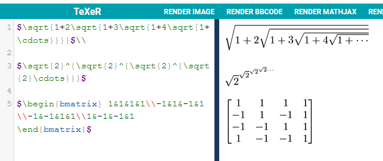

# Wiki
https://github.com/MackQian/oss-4470/wiki/Project-Ideas
# Latex

# GitStats and Gource
Link to screenshots and comments below:

https://docs.google.com/document/d/1VEmo2LpjfwZb5kb3il-Ar6woIRWM-V78JpDyJaIBDwY/edit?usp=sharing

Gitstats and gource are pretty cool tools to look at the history and statistics of git repos. I looked at the shuttle tracker project and it was cool to see how the repository evolved over time.
