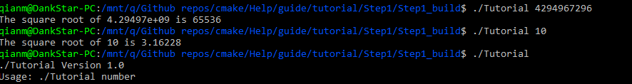
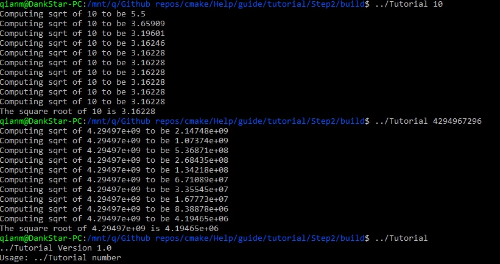
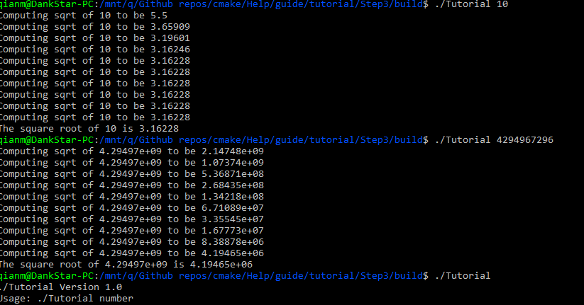
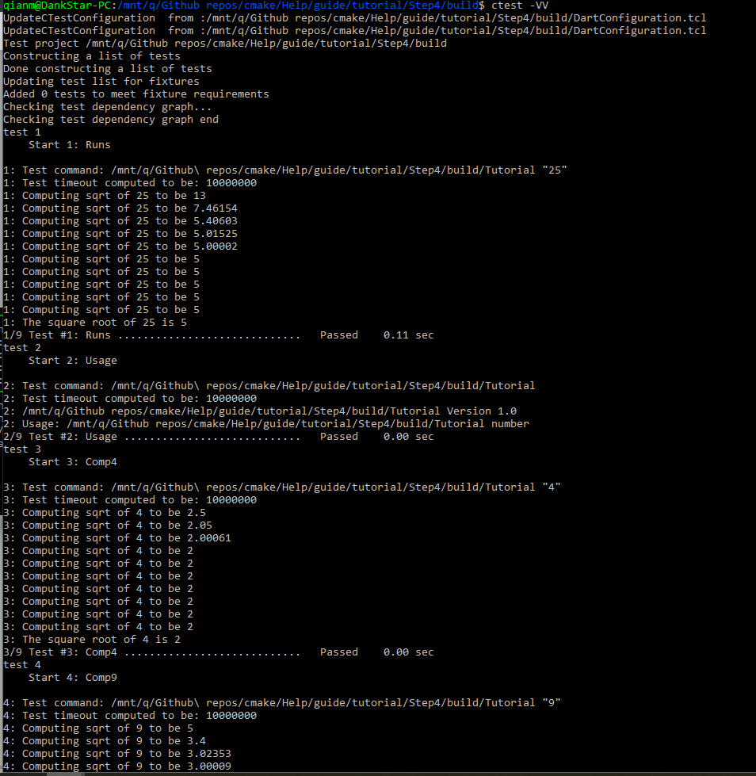
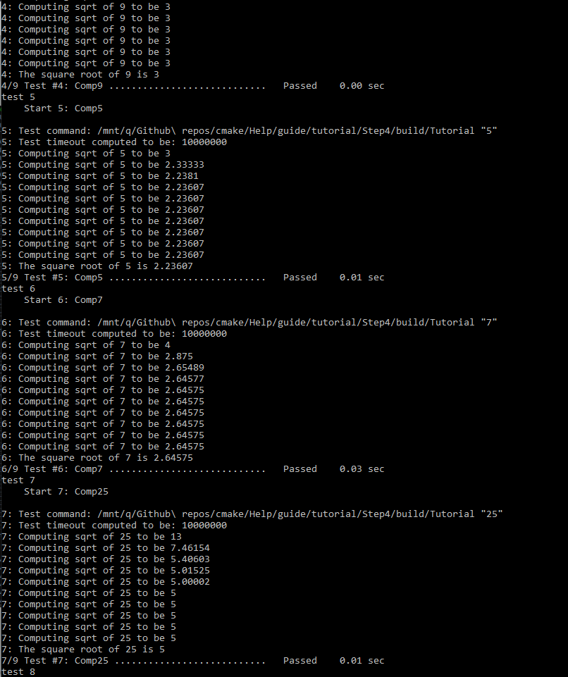
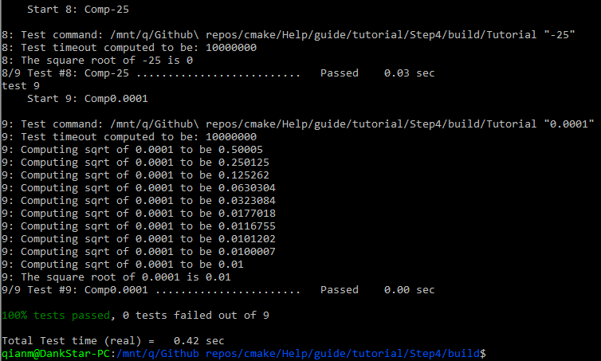
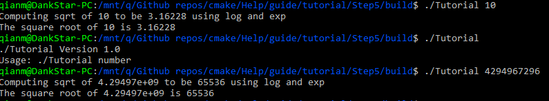
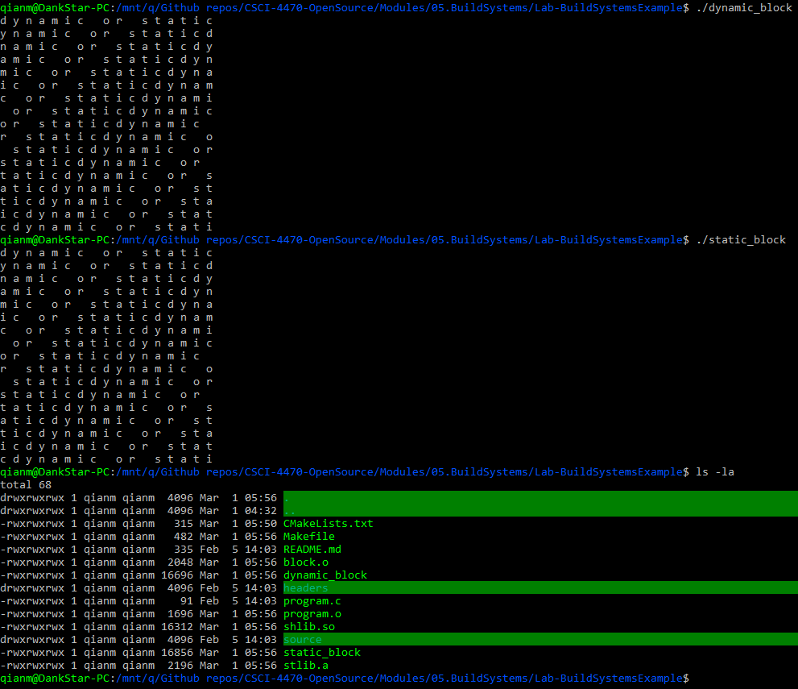

# Tutorial
## Step 1

[Step 1 CMakeLists](tutorial/step1/CMakeLists.txt)

[Step 1 Tutorial](tutorial/step1/tutorial.cxx)
## Step 2

[Step 2 CMakeLists](tutorial/step2/CMakeLists.txt)

[Step 2 Tutorial](tutorial/step2/tutorial.cxx)

## Step 3

[Step 3 CMakeLists](tutorial/step3/CMakeLists.txt)

[Step 3 MathCMakeLists](tutorial/step3/MathFunctions/CMakeLists.txt)

## Step 4

[Step 4 CMakeLists](tutorial/step4/CMakeLists.txt)

[Step 4 MathCMakeLists](tutorial/step4/MathFunctions/CMakeLists.txt)

## Step 5

[Step 5 CMakeLists](tutorial/step5/CMakeLists.txt)

[Step 5 MathCMakeLists](tutorial/step5/MathFunctions/CMakeLists.txt)

# Lab Example

[Example CMakeLists](last/CMakeLists.txt)

[Example Makefile](last/Makefile)
