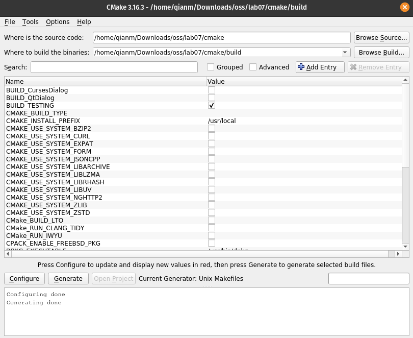
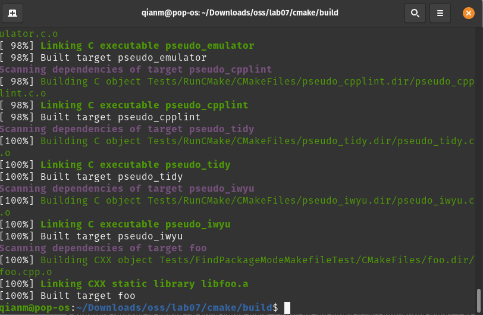
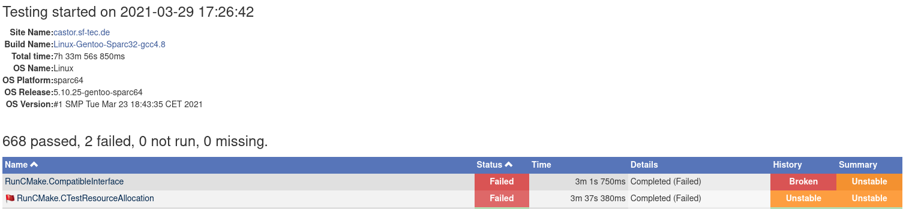
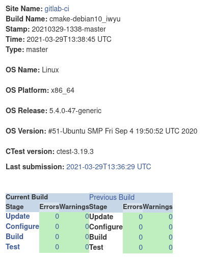
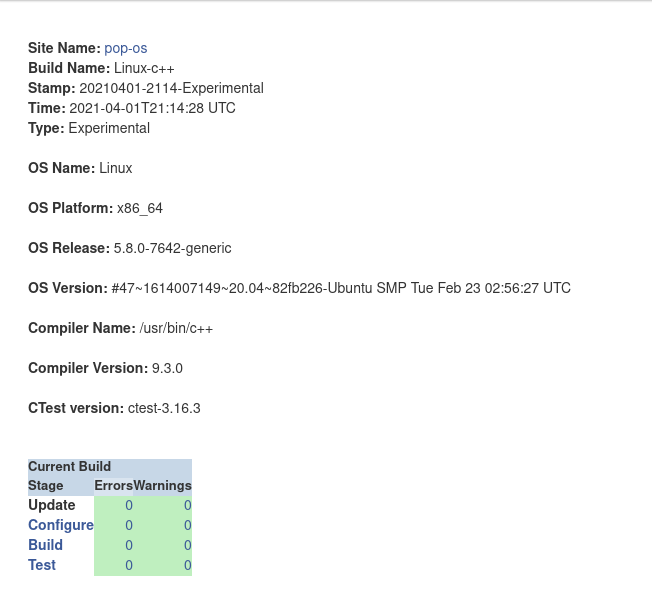
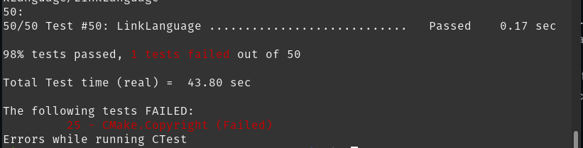
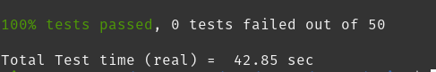

# Checkpoint 1

# Checkpoint 2
Click on the build name, then navigate to the test summary, then it shows you all tests with the failed tests at the top

They failed to match expected error message output on an Interface. This is helpful for debugging as it greatly narrows down where a potential bug could be located and a hint on what needs to be done.

The dashboard is clean and has no errors.

CDash submission: https://open.cdash.org/build/7136775

Error on Copyright:

Narrows it down by saying that the copyright failed, we fix it by updating 2020 to 2021

