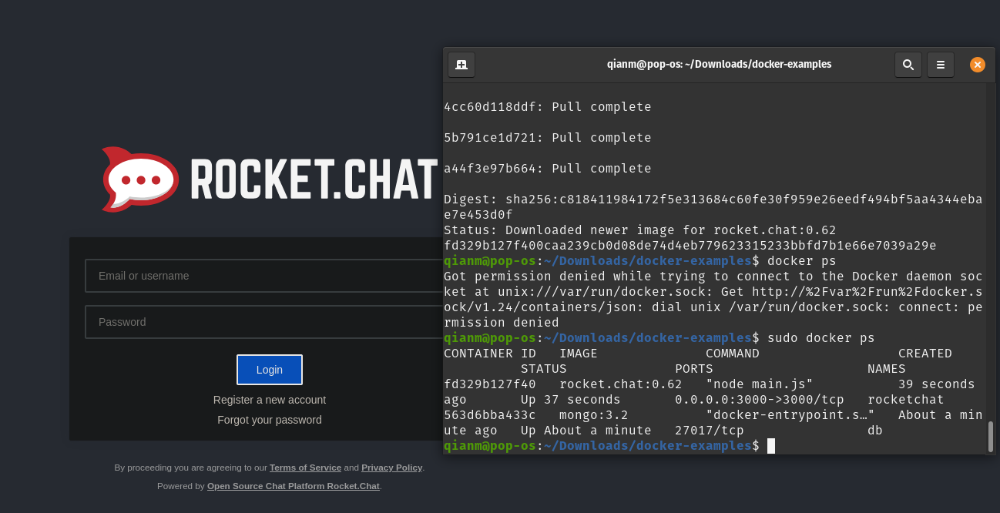

# Example 00
whalesay output from successful docker install

# Example 01
cowsay and vi usage to make wow.txt in unbuntu terminal

# Example 02 
Rocket chat up and running

# Example 03

Hello docker build: [dockerfile](./example03/dockerfile)

# Example 04
failed build without composition

sucessful build with compose and example commands run

[dockerfile](./example04/dockerfile)
[compose](./example04/docker-compose.yml)