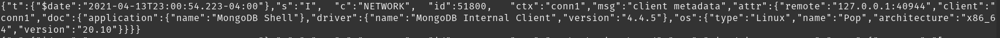
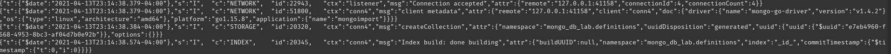
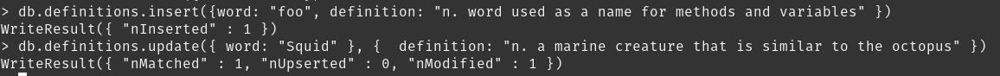
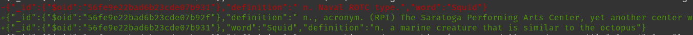

# Checkpoint 0
[blog post](https://rcos.io/projects/mackqian/ossminecraftmod/blog)

MongoDB's license change seems reasonable, but may hurt them in the long run. They want to enforce that if companies use MongoDB, they must either open source their code or obtain a commercial license. They cite their reasoning as preventing companies from just using their software without contributing back and wanting to protect the open source innovation. However, it does seem to almost be more of a cash grab than anything else and violates open source software principles. By explicitly enforcing the commercial licensing part, they may stifle competition and could charge a hefty price for a commercial license. Some are saying they are attempting to do what Oracle did decades ago. This could definitely affect companies and industry much more heavily, but for the average user, it's probably not a very big deal.

Sources: 

https://www.percona.com/blog/2020/06/16/why-is-mongodbs-sspl-bad-for-you/

https://techcrunch.com/2018/10/16/mongodb-switches-up-its-open-source-license/

https://www.scylladb.com/2018/10/22/the-dark-side-of-mongodbs-new-license/
# Checkpoint 1
connection msg


# Checkpoint 02 
import msg

# Checkpoint 03
inserted foo and updated squid

git diffs


# Checkpoint 04
[script](./checkpoint4.py)

[output](./out.txt)

# Checkpoint 5
[script](./checkpoint5.py)

output:
```
{'_id': ObjectId('56fe9e22bad6b23cde07b8d2'),
 'dates': ['2021-04-14T04:17:27.994877', '2021-04-14T04:17:28.039564'],
 'definition': ' n. Sedentary lifeform most prevalent on low slung sofas and '
               'lounges around the campus. Best sightings are in the JEC '
               'Lounge, the second floor of the Union and on every floor of '
               'the Folsom Library.',
 'word': 'Couch Potato'}
```