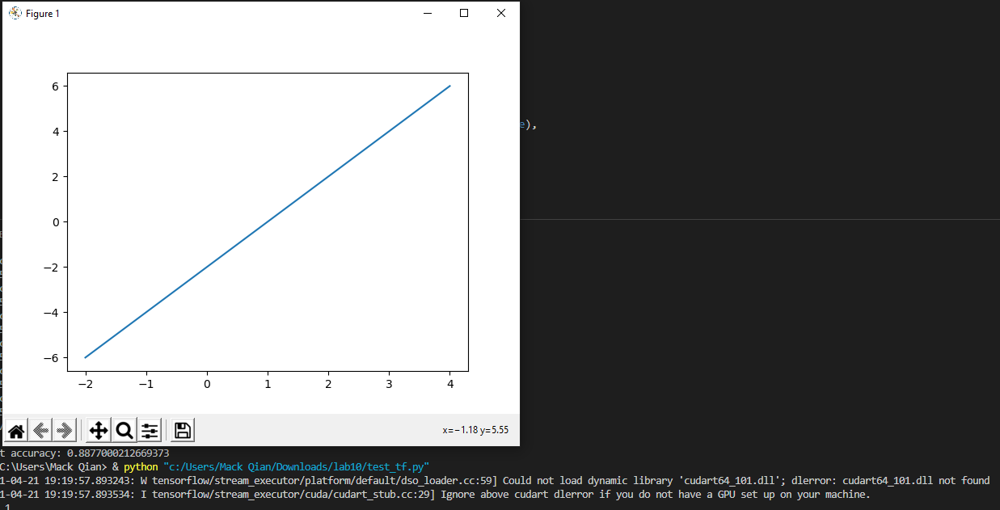
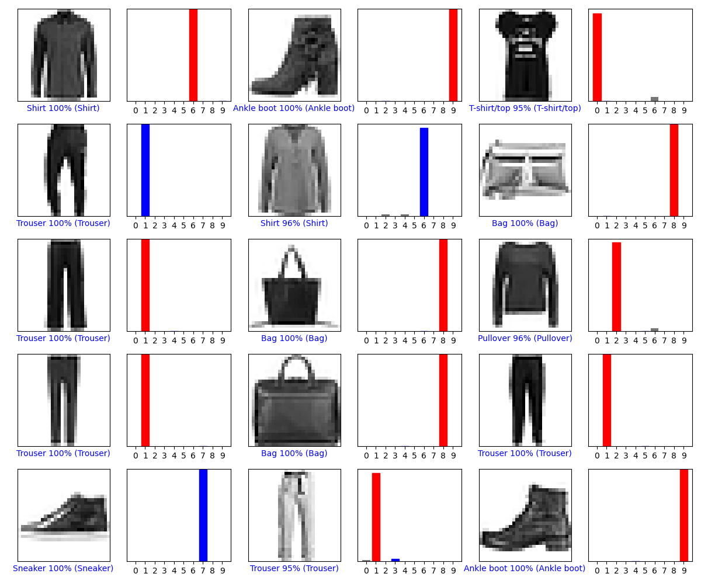
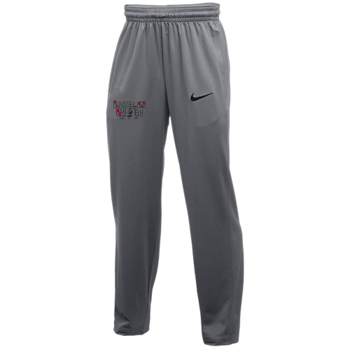
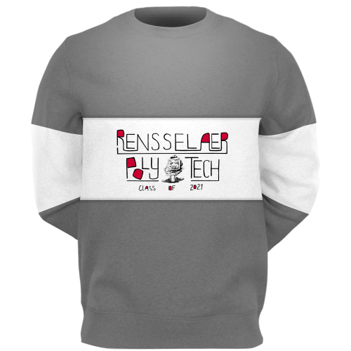
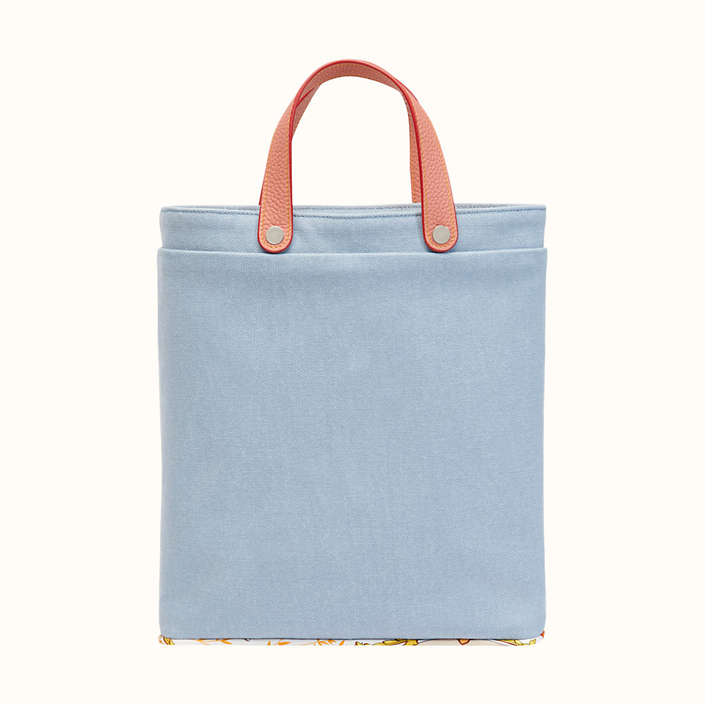
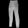
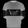
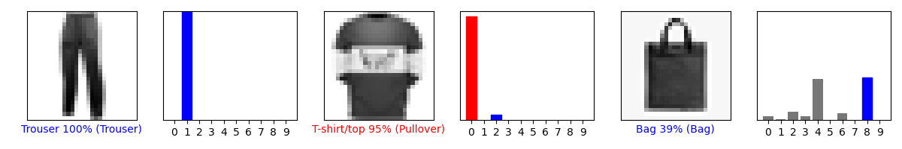

# Checkpoint 1


# Checkpoint 2

```
num_rows = 5
num_cols = 3
num_images = num_rows*num_cols
plt.figure(figsize=(2*2*num_cols, 2*num_rows))
for i in range(num_images):
  plt.subplot(num_rows, 2*num_cols, 2*i+1)
  plot_image(9000+i, predictions[9000+i], test_labels, test_images)
  plt.subplot(num_rows, 2*num_cols, 2*i+2)
  plot_value_array(i, predictions[9000+i], test_labels)
plt.tight_layout()
plt.show()
```



# Checkpoint 3

## Original Images




## Processed Images





## Code
```
img1=Image.open('./trouser.png')
img1=ImageOps.grayscale(img1)
img1=ImageOps.fit(img1,(28,28))
img1=ImageOps.invert(img1)
img1=np.array(img1)
img1=img1/255.0

img2=Image.open('./rpi_pullover.png')
img2=ImageOps.grayscale(img2)
img2=ImageOps.fit(img2,(28,28))
img2=ImageOps.invert(img2)
img2=np.array(img2)
img2=img2/255.0

img3=Image.open('./bag.jpg')
img3=ImageOps.grayscale(img3)
img3=ImageOps.fit(img3,(28,28))
img3=ImageOps.invert(img3)
img3=np.array(img3)
img3=img3/255.0

batch=np.array([img1,img2,img3])

predictions = probability_model.predict(batch)
labels=[1,2,8]
num_rows = 1
num_cols = 3
num_images = num_rows*num_cols
plt.figure(figsize=(2*2*num_cols, 2*num_rows))
for i in range(num_images):
  plt.subplot(num_rows, 2*num_cols, 2*i+1)
  plot_image(i, predictions[i], labels, batch)
  plt.subplot(num_rows, 2*num_cols, 2*i+2)
  plot_value_array(i, predictions[i], labels)
plt.tight_layout()
plt.show()
```

## Results



It got the pants down super well. The pullover was confused for shirt, but that probably due to the fact the long sleeves were behind the main body, so it looks more like a t-shirt. Bag was interesting how it was pretty close between bag and coat, but did manage to classify it correctly.
